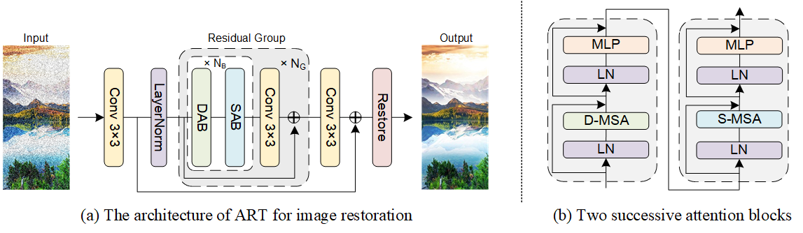

# Accurate Image Restoration with Attention Retractable Transformer
Jiale Zhang, Yulun Zhang, Jinjin Gu, Yongbing Zhang, Linghe Kong, and Xin Yuan, "Accurate Image Restoration with Attention Retractable Transformer", 2022

---
This code is the PyTorch implementation of ART model. Our ART achieves **state-of-the-art** performance in
- bicubic image SR
- color image denoising
- real image denoising
- jpeg compression artifact reduction

> **Abstract:** *Recently, Transformer-based image restoration networks have achieved promising improvements over convolutional neural networks due to parameter-independent global interactions. To lower computational cost, existing works generally limit self-attention computation within non-overlapping windows. However, each group of tokens are always from a dense area of the image. This is considered as a dense attention strategy since the interactions of tokens are restrained in dense regions. Obviously, this strategy could result in restricted receptive fields. To address this issue, we propose \textbf{A}ttention \textbf{R}etractable \textbf{T}ransformer (ART) for image restoration, which presents both dense and sparse attention modules in the network. The sparse attention module allows tokens from sparse areas to interact and thus provides a wider receptive field. Furthermore, the alternating application of dense and sparse attention modules greatly enhances representation ability of Transformer while providing retractable attention on the input image.We conduct extensive experiments on image super-resolution, denoising, and JPEG compression artifact reduction tasks. Experimental results validate that our proposed ART outperforms state-of-the-art methods on various benchmark datasets both quantitatively and visually. We also provide code and models at https://github.com/gladzhang/ART.* 
>
> <p align="center">
> 
> </p>
## Requirements
- python 3.8
- pyTorch >= 1.8.0
- [BasicSR V1.3.5](https://github.com/xinntao/BasicSR)
- timm
- NVIDIA GPU + [CUDA](https://developer.nvidia.com/cuda-downloads)

### Install BasicSR
You should install BasicSR from PyPI in advance. More details are [here](https://github.com/XPixelGroup/BasicSR/blob/master/INSTALL.md).
```bash
git clone https://github.com/gladzhang/ART.git
pip install basicsr
```

## TODO

* [x] Testing on Image SR
* [x] Testing on Color Image Denoising
* [x] Testing on Real Image Denoising 
* [x] Testing on JPEG compression artifact reduction
* [ ] Training
* [ ] More tasks
## Contents

1. [Models](#Models)
1. [Datasets](#Datasets)
1. [Testing](#Testing)
1. [Results](#Results)
1. [Acknowledgement](#Acknowledgement)

---
## Models

|  Task   | Method  | Params (M) | FLOPs (G) | Dataset  | PSNR  |  SSIM  |                          Model Zoo                           |             
| :-----: | :------ | :--------: | :-------: | :------: | :---: | :----: | :----------------------------------------------------------: | 
|   SR    | ART-S   |   11.87    |   392   | Urban100 | 27.54 | 0.8261 | [Google Drive](#) |
|   SR    | ART   |   16.55   |   782   | Urban100 | 27.77 | 0.8321 | [Google Drive](#) | 
|   Color-DN  | ART |   16.15    |  465    | Urban100 | 30.19 | 0.8912 | [Google Drive](#) | 
| Real-DN | ART     |   25.70   |  73     |   SIDD   | 39.96 | 0.9600 | [Google Drive](#) | 
|   CAR   | ART    |   16.14   | 469    |  LIVE1   | 29.89 | 0.8300 | [Google Drive](#) |

- We provide the performance on Urban100 (x4, SR), Urban100 (level=50, Color-DN) LIVE1 (q=10, CAR), and SIDD (Real-DN). We use the input 160 × 160 to calculate FLOPS.
- Download  the models and put them into the folder `experiments/pretrained_models`  . Go to the folder to find details of directory structure.

## Datasets


Used training and testing sets can be downloaded as follows:

| Task                                          |                                       Testing Set                          |    
| :-------------------------------------------- | :----------------------------------------------------------: |
| image SR                                       | Set5 + Set14 + BSD100 + Urban100 + Manga109 [[download](#)] | 
|color image denoising                          |  CBSD68 + Kodak24 + McMaster + Urban100  [[download](#)]|
| real image denoising                          | [SIDD](https://drive.google.com/file/d/11vfqV-lqousZTuAit1Qkqghiv_taY0KZ/view?usp=sharing) + [DND](https://drive.google.com/file/d/1CYCDhaVxYYcXhSfEVDUwkvJDtGxeQ10G/view?usp=sharing) [ [download](#)] |
| grayscale JPEG compression artifact reduction  | Classic5 + LIVE1 + Urban100 [[download](#)] |


Download  testing datasets and put them into the folder `datasets/`  . Go to the folder to find details of directory structure.

## Testing
### Test on SR
1. Please download the corresponding testing datasets and put them in the folder `datasets\SR`. Download the corresponding models and put them in the folder `experiments\pretrained_models`. 
2. Follow the instructions below to begin testing our ART model.
```bash
# ART model for image SR. You can find corresponding results in Table 2 of the main paper.
python basicsr/test.py -opt options/test/test_ART_SR_x2.yml
python basicsr/test.py -opt options/test/test_ART_SR_x3.yml
python basicsr/test.py -opt options/test/test_ART_SR_x4.yml
# ART-S model for image SR. You can find corresponding results in Table 2 of the main paper.
python basicsr/test.py -opt options/test/test_ART_S_SR_x2.yml
python basicsr/test.py -opt options/test/test_ART_S_SR_x3.yml
python basicsr/test.py -opt options/test/test_ART_S_SR_x4.yml
```
You can find the visual results in automatically generated file folder `/results`. 

### Test on Color Image Denoising
1.  Please download the corresponding testing datasets and put them in the folder `datasets\ColorDN`. Download the corresponding models and put them in the folder `experiments\pretrained_models`. 
2. Follow the instructions below to begin testing our ART model.
```bash
# ART model for Color Image Denoising. You can find corresponding results in Table 4 of the main paper.
python basicsr/test.py -opt options/test/test_ART_ColorDN_level15.yml
python basicsr/test.py -opt options/test/test_ART_ColorDN_level25.yml
python basicsr/test.py -opt options/test/test_ART_ColorDN_level50.yml
```

Note that you can put other benchmark datasets in `/datasets` and change YML files for further test.

### Test on RealDenoising
1. Download the [SIDD test](https://drive.google.com/file/d/11vfqV-lqousZTuAit1Qkqghiv_taY0KZ/view) and place it in '/datasets/SIDD'.  Download the corresponding models and put them in the folder `experiments\pretrained_models`. 
2. Go to folder 'realDenoising'. Follow the instructions below to test our ART model. The output is in 'realDenoising/results/Real_Denoising'/SIDD.

   ```bash
   # go to the folder
   cd realDenoising
   # test our ART (training total iterations = 300K) on SSID
   python test_real_denoising_sidd.py
   ```

3. Run the scripts below to reproduce PSNR/SSIM on SIDD. You can find corresponding results in Table 7 of the main paper.

   ```shell
   run evaluate_sidd.m
   ```

### Test on JPEG Compression Artifact Reduction
1.  Please download the corresponding testing datasets and put them in the folder `datasets\CAR`. Download the corresponding models and put them in the folder `experiments\pretrained_models`. 
2. Follow the instructions below to begin testing our ART model.
```bash
# ART model for JPEG CAR. You can find corresponding results in Table 5 of the main paper.
python basicsr/test.py -opt options/test/test_ART_CAR_q10.yml
python basicsr/test.py -opt options/test/test_ART_CAR_q30.yml
python basicsr/test.py -opt options/test/test_ART_CAR_q40.yml
```

## Results

We provide the quantitative results on image SR, color image denoising, real image denoising, and JPEG compression artifact reduction here. More results can be found in the main paper. The visual results of ART can be downloaded [here](#). 

<details>
<summary>Image SR (click to expan)</summary>

- Results of Table 2 in the main paper

<p align="center">
  
</p>

</details>

<details>
<summary>Color Image Denoising(click to expan)</summary>

- Results of Table 4 in the main paper

<p align="center">
  
</p>

</details>

<details>
<summary>Real Image Denoising (click to expan)</summary>

- Results of Table 7 in the main paper

<p align="center">
  
</p>

</details>

<details>
<summary>JPEG Compression Artifact Reduction (click to expan)</summary>

- Results of Table 5 in the main paper

<p align="center">
  
</p>

</details>

## Acknowledgement
This work is released under the Apache 2.0 license.
 The codes are based on [BasicSR](https://github.com/xinntao/BasicSR). Please also follow their licenses. Thanks for their awesome works.
