# Accurate Image Restoration with Attention Retractable Transformer
Jiale Zhang, [Yulun Zhang](http://yulunzhang.com/), [Jinjin Gu](https://www.jasongt.com/), [Yongbing Zhang](https://shinning0821.github.io/index.html), [Linghe Kong](https://www.cs.sjtu.edu.cn/~linghe.kong/), and [Xin Yuan](https://xygroup6.github.io/xygroup/), "Accurate Image Restoration with Attention Retractable Transformer", ICLR, 2023 (Spotlight)

[[paper(arXiv)](https://arxiv.org/abs/2210.01427)] [[visual results](https://drive.google.com/drive/folders/1b92XHwxuvBLOAiHAjWe-VFKN01hQUiO_?usp=sharing)] [[pretrained models](https://drive.google.com/drive/folders/1Sn1sl577Lwancj5SuQtRJk-GwUTRw7lK?usp=share_link)]

---
This code is the PyTorch implementation of ART model. Our ART achieves **state-of-the-art** performance in
- bicubic image SR
- gaussian color image denoising
- real image denoising
- jpeg compression artifact reduction

> **Abstract:** *Recently, Transformer-based image restoration networks have achieved promising improvements over convolutional neural networks due to parameter-independent global interactions. To lower computational cost, existing works generally limit self-attention computation within non-overlapping windows. However, each group of tokens are always from a dense area of the image. This is considered as a dense attention strategy since the interactions of tokens are restrained in dense regions. Obviously, this strategy could result in restricted receptive fields. To address this issue, we propose Attention Retractable Transformer (ART) for image restoration, which presents both dense and sparse attention modules in the network. The sparse attention module allows tokens from sparse areas to interact and thus provides a wider receptive field. Furthermore, the alternating application of dense and sparse attention modules greatly enhances representation ability of Transformer while providing retractable attention on the input image.We conduct extensive experiments on image super-resolution, denoising, and JPEG compression artifact reduction tasks. Experimental results validate that our proposed ART outperforms state-of-the-art methods on various benchmark datasets both quantitatively and visually. We also provide code and models at https://github.com/gladzhang/ART.* 
>
> <p align="center">
> 
> </p>

|                          *img_092 (x4)*                           |                          *img_098 (x4)*                           |                          *HR*                           |                          *LR*                           |*SwinIR*                           |*ART (ours)*                           |
| :----------------------------------------------------------: | :----------------------------------------------------------: | :----------------------------------------------------------: | :----------------------------------------------------------: |:----------------------------------------------------------: |:----------------------------------------------------------: |
| 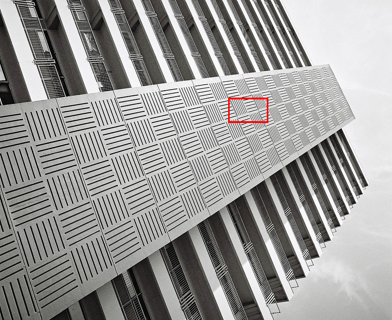 | 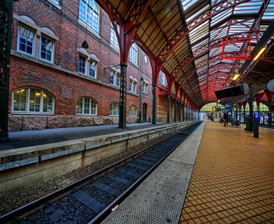 | 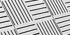  | 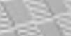  |  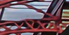 | 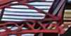 |

## Requirements
- python 3.8
- pyTorch >= 1.8.0
- NVIDIA GPU + [CUDA](https://developer.nvidia.com/cuda-downloads)

### Installation
```bash
git clone https://github.com/gladzhang/ART.git
cd ART
pip install -r requirements.txt
python setup.py develop
```

## TODO

* [x] Testing on Image SR
* [x] Testing on Color Image Denoising
* [x] Testing on Real Image Denoising 
* [x] Testing on JPEG compression artifact reduction
* [x] Training
* [ ] More tasks
## Contents

1. [Models](#Models)
1. [Datasets](#Datasets)
1. [Training](#training)
1. [Testing](#Testing)
1. [Results](#Results)
1. [Citation](#citation)
1. [Acknowledgement](#Acknowledgement)

---
## Models

|  Task   | Method  | Params (M) | FLOPs (G) | Dataset  | PSNR  |  SSIM  |                          Model Zoo                           |             
| :-----: | :------ | :--------: | :-------: | :------: | :---: | :----: | :----------------------------------------------------------: | 
|   SR    | ART-S   |   11.87    |   392   | Urban100 | 27.54 | 0.8261 | [Google Drive](https://drive.google.com/drive/folders/1Sre6vmY0aujYxvF7s7LVZtTg1Lp2AT9v?usp=sharing) |
|   SR    | ART   |   16.55   |   782   | Urban100 | 27.77 | 0.8321 | [Google Drive](https://drive.google.com/drive/folders/1oqemJJ7r7SfJA8f9YQlVKWFjk2vNAqyd?usp=sharing) | 
|   Color-DN  | ART |   16.15    |  465    | Urban100 | 30.19 | 0.8912 | [Google Drive](https://drive.google.com/drive/folders/1Ei7U7IqLg4qawMxeB3jXHKjUzyfqj7Jz?usp=sharing) | 
| Real-DN | ART     |   25.70   |  73     |   SIDD   | 39.96 | 0.9600 | [Google Drive](https://drive.google.com/drive/folders/1txjHu5c0vw0WaHk8m1qS_NjaAHUUGD8S?usp=sharing) | 
|   CAR   | ART    |   16.14   | 469    |  LIVE1   | 29.89 | 0.8300 | [Google Drive](https://drive.google.com/drive/folders/1ZZKE2fCjs_oacp57lBAzfi2gtanUQipb?usp=sharing) |

- We provide the performance on Urban100 (x4, SR), Urban100 (level=50, Color-DN) LIVE1 (q=10, CAR), and SIDD (Real-DN). We use the input 160 × 160 to calculate FLOPS.
- Download  the models and put them into the folder `experiments/pretrained_models`  . Go to the folder to find details of directory structure.

## Datasets


Used training and testing sets can be downloaded as follows:
| Task                                          |                         Training Set                         |                         Testing Set                          |                        Visual Results                        |
| :-------------------------------------------- | :----------------------------------------------------------: | :----------------------------------------------------------: | :----------------------------------------------------------: |
| image SR                                      | [DIV2K](https://data.vision.ee.ethz.ch/cvl/DIV2K/) (800 training images) +  [Flickr2K](https://cv.snu.ac.kr/research/EDSR/Flickr2K.tar) (2650 images) [complete dataset DF2K [download](https://drive.google.com/file/d/1TubDkirxl4qAWelfOnpwaSKoj3KLAIG4/view?usp=share_link)] | Set5 + Set14 + BSD100 + Urban100 + Manga109 [[download](https://drive.google.com/file/d/1n-7pmwjP0isZBK7w3tx2y8CTastlABx1/view?usp=sharing)] | [Google Drive](https://drive.google.com/drive/folders/12ecR677Hty1_WkbnKCOWaI1v4sNpVHsT?usp=share_link) |
| gaussian color image denoising                          | [DIV2K](https://data.vision.ee.ethz.ch/cvl/DIV2K/) (800 training images) +  [Flickr2K](https://cv.snu.ac.kr/research/EDSR/Flickr2K.tar) (2650 images) + [BSD500](http://www.eecs.berkeley.edu/Research/Projects/CS/vision/grouping/BSR/BSR_bsds500.tgz) (400 training&testing images) + [WED](http://ivc.uwaterloo.ca/database/WaterlooExploration/exploration_database_and_code.rar)(4744 images) [complete dataset DFWB_RGB [download](https://drive.google.com/file/d/1jPgG_URDQZ4kyXaMMXJ8AZ8jEErCdKuM/view?usp=share_link)] | CBSD68 + Kodak24 + McMaster + Urban100  [[download](https://drive.google.com/file/d/1baLpOjNlTCNbREUDAZf9Lso6YCeUOQER/view?usp=sharing)] | [Google Drive](https://drive.google.com/drive/folders/1H9nx0Gd6kfneh6anKaKzAgIn7G3djSSx?usp=share_link) |
| real image denoising                          | [SIDD](https://www.eecs.yorku.ca/~kamel/sidd/) (320 training images) [complete dataset SIDD [download](https://drive.google.com/drive/folders/1L_8ig1P71ikzf8PHGs60V6dZ2xoCixaC?usp=share_link)] | SIDD + DND [[download](https://drive.google.com/file/d/1Vuu0uhm_-PAG-5UPI0bPIaEjSfrSvsTO/view?usp=share_link)] | [Google Drive](https://drive.google.com/drive/folders/1k9EUqsqlyBMPBPzvy5nmhc1F_M_nbNo8?usp=share_link) |
| grayscale JPEG compression artifact reduction | [DIV2K](https://data.vision.ee.ethz.ch/cvl/DIV2K/) (800 training images) +  [Flickr2K](https://cv.snu.ac.kr/research/EDSR/Flickr2K.tar) (2650 images) + [BSD500](http://www.eecs.berkeley.edu/Research/Projects/CS/vision/grouping/BSR/BSR_bsds500.tgz) (400 training&testing images) + [WED](http://ivc.uwaterloo.ca/database/WaterlooExploration/exploration_database_and_code.rar)(4744 images) [complete dataset DFWB_CAR [download](https://drive.google.com/file/d/1IASyJRsX9CKBE0i5iSJMelIr_a6U5Qcd/view?usp=share_link)] | Classic5 + LIVE1 [[download](https://drive.google.com/file/d/1KJ1ArYxRubRAWP1VgONf6rly1DwiRnzZ/view?usp=sharing)] | [Google Drive](https://drive.google.com/drive/folders/1RA143yluYZAcWOzxeT7pE_olusEN99i4?usp=share_link) |


Download  training and testing datasets and put them into the folder `datasets/`. Go to the folder to find details of directory structure.

## Training
### Train on SR
1. Please download the corresponding training datasets and put them in the folder `datasets/DF2K`. Download the testing datasets and put them in the folder `datasets/SR`.
2. Follow the instructions below to begin training our ART model.
    ```bash
    # train ART for SR task, cropped input=64×64, 4 GPUs, batch size=8 per GPU
    python -m torch.distributed.launch --nproc_per_node=4 --master_port=2414 basicsr/train.py -opt options/train/train_ART_SR_x2.yml --launcher pytorch
    python -m torch.distributed.launch --nproc_per_node=4 --master_port=2414 basicsr/train.py -opt options/train/train_ART_SR_x3.yml --launcher pytorch
    python -m torch.distributed.launch --nproc_per_node=4 --master_port=2414 basicsr/train.py -opt options/train/train_ART_SR_x4.yml --launcher pytorch

    # train ART-S for SR task, cropped input=64×64, 4 GPUs, batch size=8 per GPU
    python -m torch.distributed.launch --nproc_per_node=4 --master_port=2414 basicsr/train.py -opt options/train/train_ART_S_SR_x2.yml --launcher pytorch
    python -m torch.distributed.launch --nproc_per_node=4 --master_port=2414 basicsr/train.py -opt options/train/train_ART_S_SR_x3.yml --launcher pytorch
    python -m torch.distributed.launch --nproc_per_node=4 --master_port=2414 basicsr/train.py -opt options/train/train_ART_S_SR_x4.yml --launcher pytorch
    ``` 
    Run the script then you can find the generated experimental logs in the folder `experiments`.

### Train on Gaussian Color Image Denoising
1. Please download the corresponding training datasets and put them in the folder `datasets/DFWB_RGB`. Download the testing datasets and put them in the folder `datasets/ColorDN`. 
2. Follow the instructions below to begin training our ART model.
    ```bash
    # train ART for ColorDN task, cropped input=128×128, 4 GPUs, batch size=2 per GPU
    python -m torch.distributed.launch --nproc_per_node=4 --master_port=2414 basicsr/train.py -opt options/train/train_ART_ColorDN_level15.yml --launcher pytorch
    python -m torch.distributed.launch --nproc_per_node=4 --master_port=2414 basicsr/train.py -opt options/train/train_ART_ColorDN_level25.yml --launcher pytorch
    python -m torch.distributed.launch --nproc_per_node=4 --master_port=2414 basicsr/train.py -opt options/train/train_ART_ColorDN_level50.yml --launcher pytorch
    ```
    Run the script then you can find the generated experimental logs in the folder `experiments`.


### Train on Real Image Denoising
1. Please download the corresponding training datasets and put them in the folder `datasets/SIDD`. Note that we provide both training and validating files, which are already processed.
2. Go to folder 'realDenoising'. Follow the instructions below to train our ART model.
    ```bash
    # go to the folder
    cd realDenoising
    # set the new environment (BasicSRv1.2.0), which is the same with Restormer for training.
    python setup.py develop --no_cuda_ext
    # train ART for RealDN task, 8 GPUs
    python -m torch.distributed.launch --nproc_per_node=8 --master_port=2414 basicsr/train.py -opt options/train_ART_RealDN.yml --launcher pytorch
    ```
    Run the script then you can find the generated experimental logs in the folder `realDenoising/experiments`.
3. Remember to go back to the original environment if you finish all the training or testing about real image denoising task. This is a friendly hint in order to prevent confusion in the training environment.
    ```bash
    # Tips here. Go back to the original environment (BasicSRv1.3.5) after finishing all the training or testing about real image denoising. 
    cd ..
    python setup.py develop
    ```

### Train on JPEG Compression Artifact Reduction
1. Please download the corresponding training datasets and put them in the folder `datasets/DFWB_CAR`. Download the testing datasets and put them in the folder `datasets/CAR`. 
2. Follow the instructions below to begin training our ART model.
    ```bash
    # train ART for CAR task, cropped input=126×126, 4 GPUs, batch size=2 per GPU
    python -m torch.distributed.launch --nproc_per_node=4 --master_port=2414 basicsr/train.py -opt options/train/train_ART_CAR_q10.yml --launcher pytorch
    python -m torch.distributed.launch --nproc_per_node=4 --master_port=2414 basicsr/train.py -opt options/train/train_ART_CAR_q30.yml --launcher pytorch
    python -m torch.distributed.launch --nproc_per_node=4 --master_port=2414 basicsr/train.py -opt options/train/train_ART_CAR_q40.yml --launcher pytorch
    ```
    Run the script then you can find the generated experimental logs in the folder `experiments`.

## Testing
### Test on SR
#### Test with ground-truth images
1. Please download the corresponding testing datasets and put them in the folder `datasets/SR`. Download the corresponding models and put them in the folder `experiments/pretrained_models`. 
2. Follow the instructions below to begin testing our ART model.
    ```bash
    # test ART model for image SR. You can find corresponding results in Table 2 of the main paper.
    python basicsr/test.py -opt options/test/test_ART_SR_x2.yml
    python basicsr/test.py -opt options/test/test_ART_SR_x3.yml
    python basicsr/test.py -opt options/test/test_ART_SR_x4.yml
    # test ART-S model for image SR. You can find corresponding results in Table 2 of the main paper.
    python basicsr/test.py -opt options/test/test_ART_S_SR_x2.yml
    python basicsr/test.py -opt options/test/test_ART_S_SR_x3.yml
    python basicsr/test.py -opt options/test/test_ART_S_SR_x4.yml
    ``` 
#### Test without ground-truth images
1. Please upload the images that need to be upscaled, and put them in the folder `datasets/example`. Download the corresponding models and put them in the folder `experiments/pretrained_models`. 
2. Choose the upscale size and follow the instructions below to apply our ART model to upscale the provided images.
    ```bash
    # apply ART model for image SR.
    python basicsr/test.py -opt options/apply/test_ART_SR_x2_without_groundTruth.yml
    python basicsr/test.py -opt options/apply/test_ART_SR_x3_without_groundTruth.yml
    python basicsr/test.py -opt options/apply/test_ART_SR_x4_without_groundTruth.yml
    ``` 
    Run the script then you can find the output visual results in the automatically generated folder `results`.

### Test on Gaussian Color Image Denoising
1.  Please download the corresponding testing datasets and put them in the folder `datasets/ColorDN`. Download the corresponding models and put them in the folder `experiments/pretrained_models`. 
2. Follow the instructions below to begin testing our ART model.
    ```bash
    # test ART model for Color Image Denoising. You can find corresponding results in Table 4 of the main paper.
    python basicsr/test.py -opt options/test/test_ART_ColorDN_level15.yml
    python basicsr/test.py -opt options/test/test_ART_ColorDN_level25.yml
    python basicsr/test.py -opt options/test/test_ART_ColorDN_level50.yml
    ```


### Test on Real Image Denoising
1. Download the [SIDD test](https://drive.google.com/file/d/11vfqV-lqousZTuAit1Qkqghiv_taY0KZ/view) and [DND test](https://drive.google.com/file/d/1CYCDhaVxYYcXhSfEVDUwkvJDtGxeQ10G/view?usp=sharing). Place them in `datasets/RealDN`.  Download the corresponding models and put them in the folder `experiments/pretrained_models`. 
2. Go to folder 'realDenoising'. Follow the instructions below to test our ART model. The output is in `realDenoising/results/Real_Denoising`.
    ```bash
    # go to the folder
    cd realDenoising
    # set the new environment (BasicSRv1.2.0), which is the same with Restormer for testing.
    python setup.py develop --no_cuda_ext
    # test our ART (training total iterations = 300K) on SSID
    python test_real_denoising_sidd.py
    # test our ART (training total iterations = 300K) on DND
    python test_real_denoising_dnd.py
    ```
3. Run the scripts below to reproduce PSNR/SSIM on SIDD. You can find corresponding results in Table 7 of the main paper.
   ```bash
   run evaluate_sidd.m
   ```
4. For PSNR/SSIM scores on DND, you can upload the genetated DND mat files to the [online server](https://noise.visinf.tu-darmstadt.de/) and get the results.

5. Remerber to go back to the original environment if you finish all the training or testing about real image denoising task. This is a friendly hint in order to prevent confusion in the training environment.
    ```bash
    # Tips here. Go back to the original environment (BasicSRv1.3.5) after finishing all the training or testing about real image denoising. 
    cd ..
    python setup.py develop
    ```

### Test on JPEG Compression Artifact Reduction
1.  Please download the corresponding testing datasets and put them in the folder `datasets/CAR`. Download the corresponding models and put them in the folder `experiments/pretrained_models`. 
2. Follow the instructions below to begin testing our ART model.
    ```bash
    # ART model for JPEG CAR. You can find corresponding results in Table 5 of the main paper.
    python basicsr/test.py -opt options/test/test_ART_CAR_q10.yml
    python basicsr/test.py -opt options/test/test_ART_CAR_q30.yml
    python basicsr/test.py -opt options/test/test_ART_CAR_q40.yml
    ```

## Results

We provide the results on image SR, color image denoising, real image denoising, and JPEG compression artifact reduction here. More results can be found in the main paper. The visual results of ART can be downloaded [here](https://drive.google.com/drive/folders/1b92XHwxuvBLOAiHAjWe-VFKN01hQUiO_?usp=sharing). 

<details>
<summary>Image SR (click to expan)</summary>

- Results of Table 2 in the main paper

<p align="center">
  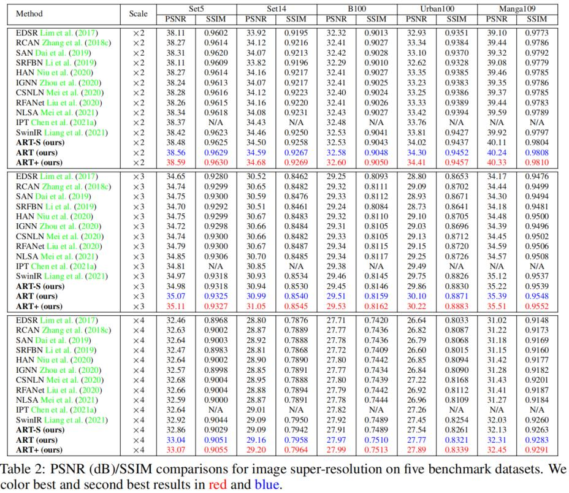
</p>

- Visual results

<p align="center">
  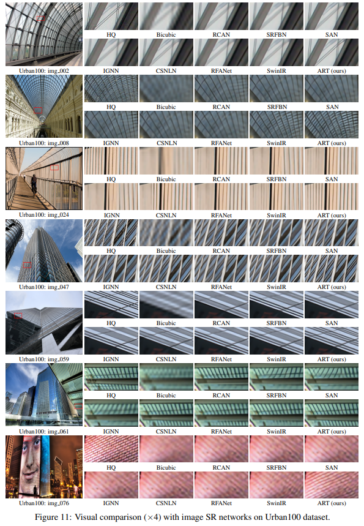
</p>

<p align="center">
  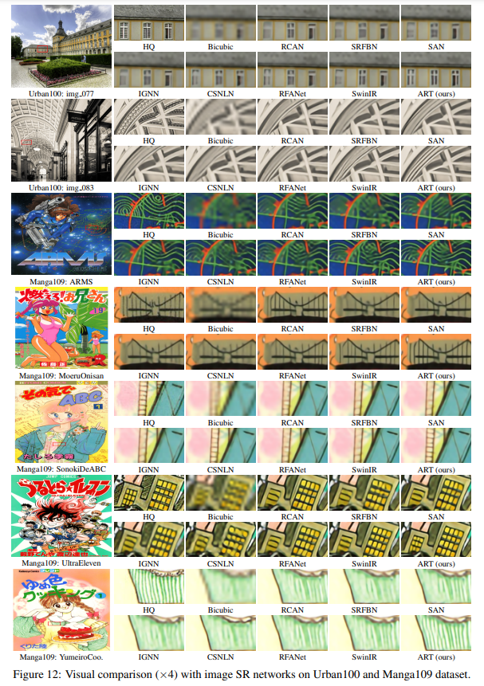
</p>

</details>

<details>
<summary>Color Image Denoising(click to expan)</summary>

- Results of Table 4 in the main paper

<p align="center">
  
</p>

- Visual results

<p align="center">
  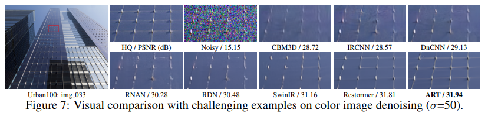
</p>

</details>

<details>
<summary>Real Image Denoising (click to expan)</summary>

- Results of Table 7 in the main paper

<p align="center">
  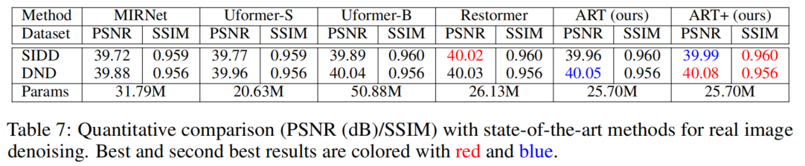
</p>

</details>

<details>
<summary>JPEG Compression Artifact Reduction (click to expan)</summary>

- Results of Table 5 in the main paper

<p align="center">
  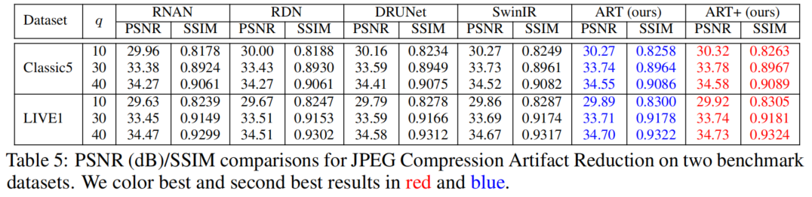
</p>

</details>

## Citation

If you find the code helpful in your resarch or work, please cite the following paper(s).
```
@inproceedings{zhang2023accurate,
  title={Accurate Image Restoration with Attention Retractable Transformer},
  author={Zhang, Jiale and Zhang, Yulun and Gu, Jinjin and Zhang, Yongbing and Kong, Linghe and Yuan, Xin},
  booktitle={ICLR},
  year={2023}
}
```

## Acknowledgement

This work is released under the Apache 2.0 license.
 The codes are based on [BasicSR](https://github.com/xinntao/BasicSR) and [Restormer](https://github.com/swz30/Restormer). Please also follow their licenses. Thanks for their awesome works.
